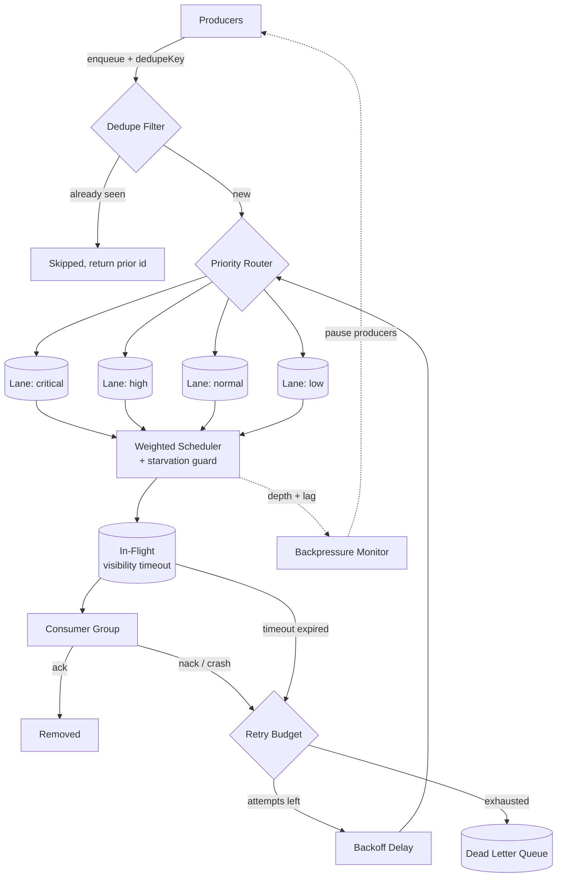

# distributed-queue

> Distributed task queue with effectively-once processing, dead-letter handling, priority lanes, visibility timeouts, backpressure, and consumer group coordination.

[](https://www.typescriptlang.org/)
[](https://nodejs.org/)
[](LICENSE)
[](#project-status)

## Project Status

**Work in progress.** The queue core, visibility timeout mechanism, priority lanes with starvation prevention, dead-letter routing, and consumer group rebalancing are implemented. Redis and PostgreSQL backends are in development.

## On "Exactly-Once"

A note up front, because this is where most queue documentation is dishonest.

**Exactly-once *delivery* is impossible** in a distributed system with unreliable networks. It follows directly from the Two Generals problem: a consumer that acknowledges a message cannot guarantee the acknowledgement arrives, and a producer that receives no acknowledgement cannot distinguish "consumer never got it" from "consumer processed it and the ack was lost".

What *is* achievable is **exactly-once processing semantics**, built from at-least-once delivery plus idempotent consumers plus deduplication. That is what this library provides, and the API is named accordingly. Any queue advertising exactly-once delivery is either redefining the term or handling deduplication on your behalf without telling you.

This library makes deduplication explicit: you supply a dedupe key, and processing is skipped for keys already seen within a configurable window.

## Architecture



### Visibility Timeout

When a consumer receives a message it is not deleted, it is moved to an in-flight set with a deadline. Three things can happen:

1. **Consumer acks** → message is removed permanently.
2. **Consumer nacks** → message returns to its lane immediately, attempt count incremented.
3. **Deadline passes** → the consumer is presumed dead, message returns to its lane automatically.

Case 3 is what makes the queue crash-safe without a heartbeat protocol. A consumer that segfaults mid-processing does not lose the message; it simply stops extending the deadline.

Long-running handlers extend their own deadline via `heartbeat()`. This is preferable to setting a huge global timeout, because a huge timeout also means a crashed consumer's messages sit unprocessed for that entire duration.

### Priority Lanes with Starvation Prevention

Strict priority ordering starves low-priority work indefinitely: as long as any critical message exists, nothing else ever runs. That is usually not what anyone actually wants.

The scheduler uses **weighted selection with an age-based override**:

```
Base weights:  critical 8, high 4, normal 2, low 1

A lane is force-promoted when its oldest message exceeds maxStarvationMs,
regardless of weight. Promotion is checked before weighted selection.
```

So critical work dominates throughput under normal conditions, but a low-priority message cannot sit forever. The starvation threshold is the explicit contract: "nothing waits longer than this, no matter its priority".

### Consumer Group Rebalancing

Consumers in a group divide the partition space. When membership changes (a consumer joins, leaves, or fails a liveness check), partitions are reassigned.

Rebalancing uses **incremental cooperative assignment**: only the partitions that must move are revoked, rather than revoking everything and reassigning from scratch. A full stop-the-world rebalance means every consumer pauses on every membership change, which for a group of twenty consumers and one restart is nineteen unnecessary pauses.

### Backpressure

When queue depth or consumer lag crosses thresholds, the queue signals producers to slow down. Signalling is preferable to silently accepting unbounded work: an unbounded queue converts a throughput problem into an out-of-memory crash, and moves the failure from the component that can handle it to the one that cannot.

## Installation

```bash
npm install @q1-digital/distributed-queue
```

## Quick Start

```typescript
import { DistributedQueue } from '@q1-digital/distributed-queue';

const queue = new DistributedQueue({
  name: 'email-delivery',
  backend: {
    provider: 'redis',
    url: process.env.REDIS_URL!,
  },
  lanes: {
    critical: { weight: 8 },
    high:     { weight: 4 },
    normal:   { weight: 2 },
    low:      { weight: 1 },
  },
  scheduling: {
    maxStarvationMs: 60_000,   // Nothing waits longer than this
  },
  visibility: {
    timeoutMs: 30_000,
    maxExtensions: 10,          // Cap on heartbeat extensions
  },
  retry: {
    maxAttempts: 5,
    baseDelayMs: 1_000,
    maxDelayMs: 300_000,
    jitter: true,
  },
  deduplication: {
    enabled: true,
    windowMs: 3_600_000,        // 1 hour
  },
  backpressure: {
    maxDepth: 100_000,
    maxLagMs: 120_000,
  },
});

// Produce
const { id, deduplicated } = await queue.enqueue({
  payload: { to: 'user@example.com', template: 'welcome' },
  priority: 'high',
  dedupeKey: 'welcome-email:user_882',   // Same key within the window is skipped
  delayMs: 0,
});

if (deduplicated) {
  console.log('Already enqueued as', id);
}

// Consume
await queue.consume({
  groupId: 'email-workers',
  concurrency: 4,
  handler: async (message, ctx) => {
    // Long work extends its own visibility deadline
    const timer = setInterval(() => ctx.heartbeat(), 10_000);

    try {
      await sendEmail(message.payload, { signal: ctx.signal });
      // Returning normally acks the message
    } catch (error) {
      if (isPermanent(error)) {
        // Skip remaining retries, go straight to DLQ
        throw ctx.deadLetter('INVALID_RECIPIENT', error.message);
      }
      throw error;  // Retried per policy
    } finally {
      clearInterval(timer);
    }
  },
});
```

### Backpressure Handling

```typescript
queue.on('backpressure', ({ reason, depth, lagMs }) => {
  console.warn(`Slow down: ${reason} (depth=${depth}, lag=${lagMs}ms)`);
  producer.pause();
});

queue.on('backpressure:relieved', () => producer.resume());

// Or check before producing
if (await queue.shouldThrottle()) {
  await sleep(1_000);
}
```

### Dead Letter Inspection and Replay

```typescript
const dead = await queue.deadLetters({ limit: 50 });

for (const d of dead) {
  console.log(d.id, d.reason, d.attempts, d.lastError, d.firstFailedAt);
}

// Replay after fixing the underlying cause
await queue.replay({
  ids: dead.filter(d => d.reason === 'SMTP_TIMEOUT').map(d => d.id),
  resetAttempts: true,
  priority: 'low',   // Replays should not preempt live traffic
});
```

### Consumer Group Events

```typescript
queue.on('rebalance:start', ({ groupId, members, reason }) => {
  console.log(`Rebalancing ${groupId}: ${reason}`);
});

queue.on('rebalance:complete', ({ assigned, revoked, durationMs }) => {
  console.log(`+${assigned.length} -${revoked.length} in ${durationMs}ms`);
});
```

## Configuration

```typescript
interface QueueConfig {
  name: string;
  backend: { provider: 'redis' | 'postgres' | 'memory'; url?: string };
  lanes: Record<string, { weight: number }>;
  scheduling: { maxStarvationMs: number };
  visibility: { timeoutMs: number; maxExtensions: number };
  retry: { maxAttempts: number; baseDelayMs: number; maxDelayMs: number; jitter: boolean };
  deduplication?: { enabled: boolean; windowMs: number };
  backpressure?: { maxDepth: number; maxLagMs: number };
}
```

## Project Structure

```
src/
├── core/
│   ├── queue.ts                    # Public API: enqueue, consume, replay
│   ├── message.ts                  # Message envelope + metadata
│   └── config.ts                   # Zod schemas + invariant checks
├── scheduling/
│   ├── scheduler.ts                # Weighted lane selection
│   ├── starvation-guard.ts         # Age-based lane promotion
│   └── delay-wheel.ts              # Timing wheel for delayed messages
├── delivery/
│   ├── visibility.ts               # In-flight set + deadline tracking
│   ├── heartbeat.ts                # Deadline extension
│   └── acknowledgement.ts          # Ack / nack handling
├── deduplication/
│   ├── dedupe-filter.ts            # Windowed key tracking
│   └── bloom.ts                    # Space-efficient pre-filter
├── consumer/
│   ├── group.ts                    # Membership + liveness
│   ├── rebalancer.ts               # Cooperative incremental assignment
│   └── worker.ts                   # Bounded-concurrency processing loop
├── resilience/
│   ├── retry.ts                    # Backoff with full jitter
│   ├── dead-letter.ts              # DLQ routing + replay
│   └── backpressure.ts             # Depth + lag monitoring
├── backends/
│   ├── redis.backend.ts            # Lua scripts for atomic ops
│   ├── postgres.backend.ts         # SKIP LOCKED based claiming
│   └── memory.backend.ts           # Testing
└── index.ts
```

## Design Decisions

**Why name it "effectively-once" instead of "exactly-once"?** Because exactly-once delivery is provably impossible across an unreliable network, and claiming it teaches users to skip the idempotency work they actually still need. Naming the guarantee accurately is a correctness feature.

**Why visibility timeout instead of consumer heartbeats?** A heartbeat protocol requires the consumer to keep proving it is alive on a separate channel, and a network partition then looks identical to a crash. Visibility timeout inverts it: the message is safe by default and only stays claimed while a consumer actively extends it. Fewer moving parts, same guarantee.

**Why cap heartbeat extensions?** Without a cap, a consumer stuck in an infinite loop extends its deadline forever and the message is never reprocessed. The cap converts "stuck forever" into "eventually retried elsewhere".

**Why weighted lanes rather than strict priority?** Strict priority starves lower lanes indefinitely, and in practice "low priority" means "later", not "never". The starvation guard turns that intent into an explicit bound.

**Why cooperative incremental rebalancing?** A stop-the-world rebalance pauses every consumer on every membership change. In a group of twenty, one rolling restart triggers twenty full pauses. Moving only the partitions that must move keeps the other consumers working.

**Why signal backpressure instead of buffering?** An unbounded buffer converts a throughput problem into an out-of-memory crash, and relocates the failure from the producer (which could have slowed down) to the queue (which cannot). Explicit backpressure keeps the decision where the information is.

**Why `SKIP LOCKED` for the PostgreSQL backend?** It lets many consumers claim distinct rows concurrently without blocking each other or requiring an external lock service. Without it, consumers serialize on the same head-of-queue row.

## Roadmap

- [ ] Redis backend with atomic Lua claim/ack scripts
- [ ] PostgreSQL backend using `FOR UPDATE SKIP LOCKED`
- [ ] Message batching for high-throughput lanes
- [ ] Scheduled and cron-style recurring messages
- [ ] OpenTelemetry trace propagation through the queue
- [ ] Chaos test suite (kill consumers mid-processing, partition the backend)

## License

MIT
